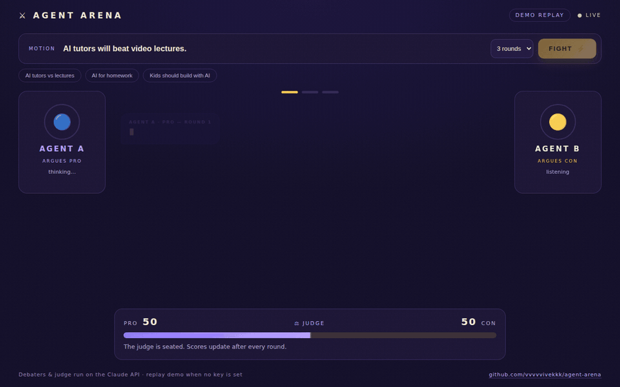

# ⚔ Agent Arena

**Two LLM agents argue a motion in real time. A judge agent scores every round. You watch it happen, token by token.**



Pick a motion ("AI tutors will beat video lectures"), hit **FIGHT**, and Agent A (PRO) and Agent B (CON) debate it live — each turn streams into the arena as it's generated, each agent visibly *thinking → speaking → listening*, while an LLM judge updates a PRO/CON scorebar after every round and hands down a final verdict.

An experiment in **adversarial multi-agent reasoning**: a good argument beats a single answer, because the disagreement surfaces weak claims, hidden assumptions, and the evidence that actually holds up.

## How it works

```
 browser ──SSE──▶ server.js ──▶ lib/orchestrator.js ──▶ round loop
                                     │
                     ┌───────────────┴───────────────┐
                lib/claude.js                   lib/demo.js
            (Claude API, streaming)        (canned replay, no key)
                     │
          Agent A (PRO) ⇄ Agent B (CON) → ⚖ Judge (strict-JSON scores)
```

- **Orchestrator** (`lib/orchestrator.js`) — provider-agnostic debate loop. Each round: PRO argues (seeing the transcript), CON rebuts, the judge scores the debate so far. Emits a typed event stream (`start`, `turn_start`, `token`, `turn_end`, `judge`, `verdict`, `done`) consumed over Server-Sent Events.
- **Live mode** (`lib/claude.js`) — debaters stream from the Claude API (`claude-opus-5-5` by default) with low effort for punchy ≤60-word turns; the judge returns strict JSON, parsed defensively and clamped. Server-side refusal fallbacks are enabled by default (`fallbacks: "default"`), so a safety decline retries on a fallback model inside the same call.
- **Demo mode** (`lib/demo.js`) — with no API key (or `?demo=1`), a canned debate replays through the *same* pipeline, word-streamed, so the full experience works anywhere. Hosted statically (GitHub Pages), the front end detects there's no server and replays entirely client-side.
- **UI** (`public/`) — vanilla JS/CSS operations-console: agent pods with thinking/speaking states, a streaming debate feed with typing carets, a live judge scorebar, round pips, and a verdict stamp. No frameworks.

## Run it

```sh
npm install

# Live debates (agents run on the Claude API):
export ANTHROPIC_API_KEY=sk-ant-...
npm start

# Or no key at all — demo replay mode:
npm start
```

Open http://localhost:3000.

| Env var | Default | What it does |
|---|---|---|
| `ANTHROPIC_API_KEY` | — | Enables live mode |
| `ARENA_MODEL` | `claude-opus-5-5` | Model for both debaters |
| `ARENA_JUDGE_MODEL` | same as `ARENA_MODEL` | Model for the judge |
| `ARENA_NO_FALLBACK` | — | Set to disable server-side refusal fallbacks |
| `PORT` | `3000` | Server port |

## Test it

```sh
npm test
```

Unit tests drive the orchestrator with a fake LLM (event ordering, transcript handoff, abort, error paths, judge-JSON parsing) and boot the real server to assert the full SSE stream end-to-end.

## Deploy

- **Full app** (live debates): any Node host — `npm start` with `ANTHROPIC_API_KEY` set.
- **Static demo**: the included GitHub Actions workflow publishes `public/` to GitHub Pages; the UI auto-falls back to client-side demo replay.

---

Built by [Vivek Reddy](https://vvvvvivekkk.github.io/portfolio-vivek/) · vivekreddy0103@gmail.com
